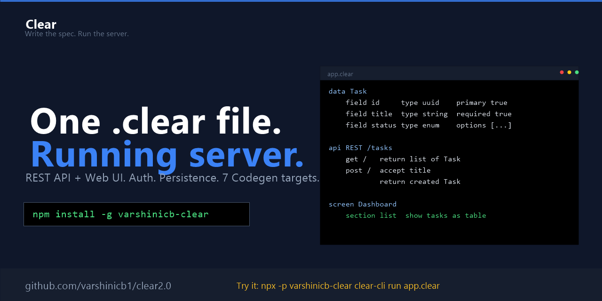
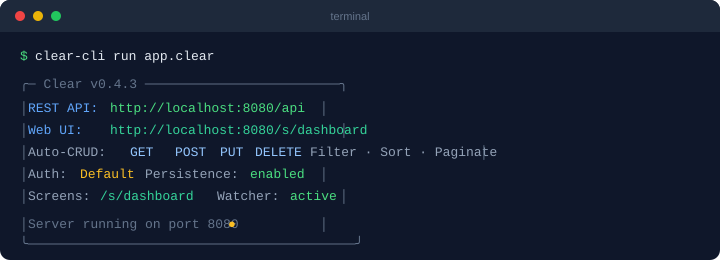
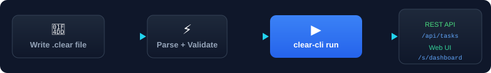
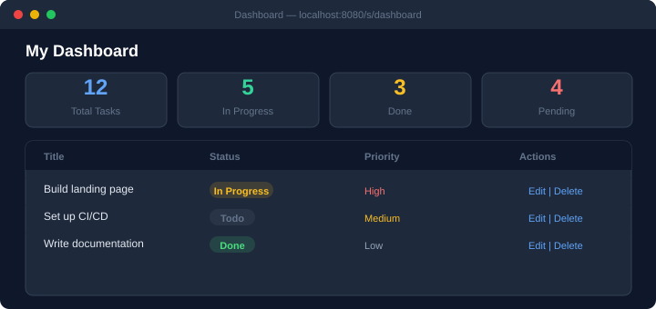

<p align="center">
  
</p>

<p align="center">
  <strong>One .clear file → Instant REST API + Web UI. No boilerplate. No build step. Just run.</strong>
</p>

<p align="center">
  <a href="https://www.npmjs.com/package/varshinicb-clear"></a>
  <a href="https://nodejs.org"></a>
  <a href="https://github.com/varshinicb1/clear2.0"></a>
  <a href="LICENSE"></a>
<br/>
  <a href="#"></a>
  <a href="#"></a>
  <a href="#"></a>
  <a href="#"></a>
</p>

---

## 🚀 Quickstart

```bash
npm install -g varshinicb-clear
```

Create `app.clear`:

```clear
product MyAPI
    name "My API"

data Task
    field id       type uuid      primary true
    field title    type string    required true
    field status   type enum      options ["todo", "in_progress", "done"]

api REST /tasks
    get /    return list of Task
    post /   accept title     return created Task    status 201

screen Dashboard
    section list   show tasks as table
    section stats  show tasks as stat   label "Tasks"
```

Run it:

```bash
clear-cli run app.clear
```



| | |
|---|---|
| 🌐 **REST API** | `http://localhost:8080/api/tasks` |
| 🎨 **Web UI** | `http://localhost:8080/s/dashboard` |
| 🔄 **Auto CRUD** | GET, POST, PUT, DELETE — all generated |
| 🔍 **Filter + Sort + Paginate** | `?status=todo&_sort=created_at&_page=1` |
| 💾 **Persistence** | Auto-saves to `.clear-data/` — survives restarts |

**No database. No ORM. No frontend framework. No Docker. No config files.**

---

## ✨ How It Works



### One file is all you need

| You write | What you get for free |
|-----------|----------------------|
| `data Task` | Type-safe CRUD store with auto UUIDs |
| 4 lines of routes | Full REST API — GET, POST, PUT, DELETE |
| 2 `show` lines | Live dashboard with tables, charts, stat cards |
| Nothing | Auto-generated OpenAPI docs |
| Nothing | Auto-generated Postman collection |
| Nothing | File persistence that survives restarts |
| Nothing | Filtering, sorting, and pagination |
| Nothing | CORS, JSON parsing, error handling |

### Your dashboard, instantly



Auto-generated from `screen Dashboard` — tables, charts, kanban, forms, all rendered server-side as HTML/SVG.

---

## 📦 What's Under the Hood

A complete language runtime, built from scratch:

**🧠 Language** — 13 keywords, 12 types, indentation-based grammar, hand-written recursive descent parser + semantic validator

**⚡ Live Interpreter** — Zero-dependency HTTP server, in-memory CRUD store, hot reload, 14 HTML/SVG UI components (tables, kanban, bar/line/pie charts, calendars, timelines, forms, carousels, data grids)

**🔐 Auth System** — Token-based signup/login/logout with session management, route protection middleware

**🔄 Flow Engine** — Scheduled ETL pipelines with conditional branching, data transforms, and upsert logic

**🎯 7 Code Generators** — TypeScript, Express.js, Hono, Fastify, Koa, OpenAPI 3.0, Postman v2.1

**⚛️ React Generator** — Full Vite + React + TypeScript apps from `.clear` files

**🤖 MCP Server** — 6 tools for AI agents (validate, build, explain, list models/APIs/screens)

**🖥️ VS Code Extension** — Syntax highlighting, 12 snippets, Run/Check/Build commands

---

## 📋 Real World Example

```bash
clear-cli run examples/team-collab/team-collab.clear
```

| What's inside | Count |
|---------------|-------|
| Data Models | User, Project, Task, Document, Comment, Notification |
| API Endpoints | 18 REST endpoints across 5 resources |
| Screens | Dashboard, Kanban Board, Calendar, Documents, Team, Activity |
| Auth | Email/password signup + login + protected routes |
| Flow | Daily digest notification scheduler |

```clear
product TeamCollab
    name "Team Collaboration Hub"

data User
    field id       type uuid      primary true
    field name     type string    required true
    field email    type email     required true    unique true

data Task
    field id        type uuid           primary true
    field title     type string         required true
    field project   type reference Project       required true
    field assignee  type reference User
    field status    type enum           options ["backlog", "todo", "in_progress", "review", "done"]
    field priority  type enum           options ["low", "medium", "high", "urgent"]

auth Default
    accept email, password, name
    session jwt   expire 7 days

screen Kanban
    section board    show tasks as kanban

screen Calendar
    section timeline show tasks as calendar   date due_date
```

---

## 🛠️ CLI Commands

| Command | Description |
|---------|-------------|
| `clear-cli run app.clear` | Start live server (REST API + Web UI) |
| `clear-cli check app.clear` | Parse + validate a .clear file |
| `clear-cli build app.clear --target express` | Generate Express.js server |
| `clear-cli build app.clear --target openapi` | Export OpenAPI 3.0 spec |
| `clear-cli build app.clear --target postman` | Export Postman collection |
| `clear-cli build app.clear --target hono` | Generate Hono server |
| `clear-cli build app.clear --target fastify` | Generate Fastify server |
| `clear-cli build app.clear --target koa` | Generate Koa server |
| `clear-cli init my-app` | Scaffold a new project |
| `clear-cli mcp` | Start MCP server for AI agents |

### Run Options
`--port 3000` · `--verbose` · `--silent` · `--watch` · `--resolve-depth 5` · `--max-response-size 100000`

---

## 🖌️ Screen Components

| Component | Syntax | What you get |
|-----------|--------|--------------|
| Table | `show tasks as table` | Sortable data table |
| Kanban | `show tasks as kanban` | Columns grouped by status |
| Bar Chart | `show sales as bar` | SVG bar chart |
| Line Chart | `show revenue as line` | SVG line chart |
| Pie Chart | `show distribution as pie` | SVG pie chart |
| Calendar | `show events as calendar` | Month view calendar |
| Timeline | `show milestones as timeline` | Date-ordered Gantt view |
| Data Grid | `show items as datagrid` | Editable inline table |
| Stat Card | `show tasks as stat` | KPI metric display |
| Cards | `show users as list` | Card grid layout |
| Search | `search` | Auto-filter search bar |
| Forms | `field ...` | Auto-generated from model |
| Tabs | `tabs / tab "X"` | Tabbed containers |

---

## 🎯 Try It Now

```bash
# One-liner — no install required:
npx -p varshinicb-clear clear-cli run app.clear

# Or install globally:
npm install -g varshinicb-clear
```

**GitHub:** [github.com/varshinicb1/clear2.0](https://github.com/varshinicb1/clear2.0)
**npm:** [`varshinicb-clear`](https://www.npmjs.com/package/varshinicb-clear)
**Playground:** [varshinicb1.github.io/clear2.0](https://varshinicb1.github.io/clear2.0)

---

## 🤖 AI Agent Integration

Clear ships with an MCP server so AI agents can work with `.clear` files:

```bash
clear-cli mcp
```

Or add to your AI agent's `.mcp.json`:
```json
{
  "mcpServers": {
    "clear": {
      "command": "npx",
      "args": ["-y", "varshinicb-clear@latest", "clear-mcp"]
    }
  }
}
```

**Tools:** `validate`, `build`, `explain`, `list_models`, `list_apis`, `list_screens`

See [AGENTS.md](AGENTS.md) for the full agent guide.

---

## 📦 Package

Published on npm as [`varshinicb-clear`](https://www.npmjs.com/package/varshinicb-clear):

```bash
npm install -g varshinicb-clear
# OR run without installing:
npx -p varshinicb-clear clear-cli run app.clear
```

---

## 📖 Language Spec

- **13 keywords**: `product`, `data`, `screen`, `flow`, `rule`, `example`, `agent`, `skill`, `api`, `event`, `config`, `deploy`, `auth`
- **8 primitive types**: string, integer, float, boolean, timestamp, uuid, url, email
- **4 compound types**: list, map, enum, reference
- **Indentation-based**: 4-space hierarchy, no braces
- **Full spec**: See [spec/](spec/) directory

---

## 🔧 VS Code Extension

The [vscode-extension/](vscode-extension/) directory contains a VS Code extension with:
- Syntax highlighting for `.clear` files
- 12 code snippets
- Commands: Run, Validate, Build

---

## 📄 License

MIT — see [LICENSE](LICENSE).
